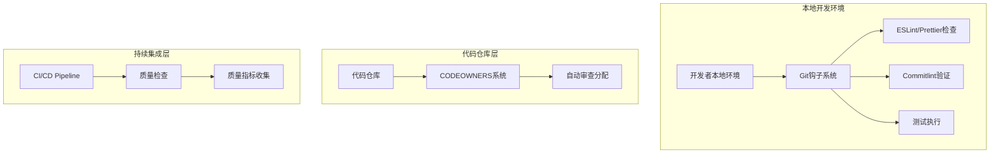
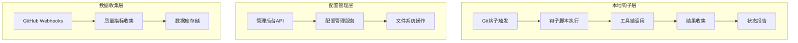
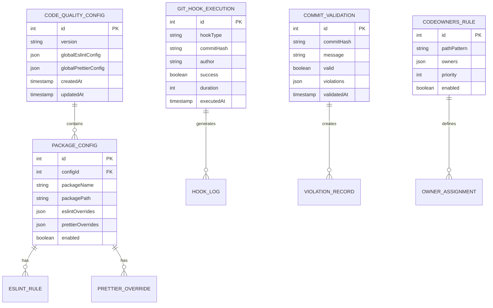

## 1. Architecture Design



## 2. Technology Description

- Frontend: 无独立前端（集成在现有管理后台中）
- Backend: 无独立后端（基于Git钩子和GitHub/GitLab功能）
- 工具链: ESLint@8 + Prettier@3 + Husky@8 + lint-staged@15 + commitlint@18
- 包管理: pnpm workspace（已有）
- 版本控制: Git + GitHub Actions

## 3. Route Definitions

| Route                       | Purpose                                    |
| --------------------------- | ------------------------------------------ |
| /admin/code-quality         | 代码质量监控页面，展示ESLint违规统计和趋势 |
| /admin/code-quality/config  | 配置管理页面，管理ESLint/Prettier规则      |
| /admin/code-quality/hooks   | Git钩子管理页面，查看钩子执行状态和日志    |
| /admin/code-quality/commits | 提交规范监控页面，展示commitlint统计       |
| /admin/code-quality/owners  | CODEOWNERS管理页面，配置代码审查责任       |

## 4. API Definitions

### 4.1 Core API

代码质量配置管理

```
GET /api/admin/code-quality/config
```

Response:
| Param Name | Param Type | Description |
|------------|------------|-------------|
| eslintConfig | object | ESLint配置对象 |
| prettierConfig | object | Prettier配置对象 |
| packages | array | 包配置列表 |

```
PUT /api/admin/code-quality/config
```

Request:
| Param Name | Param Type | isRequired | Description |
|------------|------------|------------|-------------|
| packageName | string | true | 包名称 |
| eslintRules | object | false | ESLint规则覆盖 |
| prettierOverrides | object | false | Prettier配置覆盖 |

Git钩子状态查询

```
GET /api/admin/code-quality/hooks/status
```

Response:
| Param Name | Param Type | Description |
|------------|------------|-------------|
| preCommit | object | pre-commit钩子状态 |
| prePush | object | pre-push钩子状态 |
| lastExecution | object | 最近执行记录 |

提交规范统计

```
GET /api/admin/code-quality/commits/stats
```

Request:
| Param Name | Param Type | isRequired | Description |
|------------|------------|------------|-------------|
| startDate | string | false | 开始日期 |
| endDate | string | false | 结束日期 |
| author | string | false | 作者筛选 |

Response:
| Param Name | Param Type | Description |
|------------|------------|-------------|
| totalCommits | number | 总提交数 |
| validCommits | number | 符合规范的提交数 |
| violationTypes | object | 违规类型统计 |

Example:

```json
{
  "totalCommits": 150,
  "validCommits": 142,
  "violationTypes": {
    "missing-type": 5,
    "invalid-scope": 2,
    "too-long": 1
  }
}
```

## 5. Server Architecture Diagram



## 6. Data Model

### 6.1 Data Model Definition



### 6.2 Data Definition Language

代码质量配置表 (code_quality_configs)

```sql
-- 创建代码质量配置表
CREATE TABLE code_quality_configs (
    id UUID PRIMARY KEY DEFAULT gen_random_uuid(),
    version VARCHAR(20) NOT NULL,
    global_eslint_config JSONB NOT NULL DEFAULT '{}',
    global_prettier_config JSONB NOT NULL DEFAULT '{}',
    created_at TIMESTAMP WITH TIME ZONE DEFAULT NOW(),
    updated_at TIMESTAMP WITH TIME ZONE DEFAULT NOW()
);

-- 创建包配置表
CREATE TABLE package_configs (
    id UUID PRIMARY KEY DEFAULT gen_random_uuid(),
    config_id UUID REFERENCES code_quality_configs(id) ON DELETE CASCADE,
    package_name VARCHAR(100) NOT NULL,
    package_path VARCHAR(255) NOT NULL,
    eslint_overrides JSONB DEFAULT '{}',
    prettier_overrides JSONB DEFAULT '{}',
    enabled BOOLEAN DEFAULT true,
    created_at TIMESTAMP WITH TIME ZONE DEFAULT NOW(),
    updated_at TIMESTAMP WITH TIME ZONE DEFAULT NOW()
);

-- 创建Git钩子执行记录表
CREATE TABLE git_hook_executions (
    id UUID PRIMARY KEY DEFAULT gen_random_uuid(),
    hook_type VARCHAR(20) NOT NULL CHECK (hook_type IN ('pre-commit', 'pre-push', 'commit-msg')),
    commit_hash VARCHAR(40),
    author VARCHAR(100),
    success BOOLEAN NOT NULL,
    duration INTEGER, -- 执行时间（毫秒）
    error_message TEXT,
    executed_at TIMESTAMP WITH TIME ZONE DEFAULT NOW()
);

-- 创建提交验证记录表
CREATE TABLE commit_validations (
    id UUID PRIMARY KEY DEFAULT gen_random_uuid(),
    commit_hash VARCHAR(40) NOT NULL,
    commit_message TEXT NOT NULL,
    valid BOOLEAN NOT NULL,
    violations JSONB DEFAULT '[]',
    validated_at TIMESTAMP WITH TIME ZONE DEFAULT NOW()
);

-- 创建CODEOWNERS规则表
CREATE TABLE codeowners_rules (
    id UUID PRIMARY KEY DEFAULT gen_random_uuid(),
    path_pattern VARCHAR(255) NOT NULL,
    owners JSONB NOT NULL DEFAULT '[]',
    priority INTEGER DEFAULT 0,
    enabled BOOLEAN DEFAULT true,
    created_at TIMESTAMP WITH TIME ZONE DEFAULT NOW(),
    updated_at TIMESTAMP WITH TIME ZONE DEFAULT NOW()
);

-- 创建索引
CREATE INDEX idx_package_configs_name ON package_configs(package_name);
CREATE INDEX idx_git_hook_executions_type ON git_hook_executions(hook_type);
CREATE INDEX idx_git_hook_executions_date ON git_hook_executions(executed_at DESC);
CREATE INDEX idx_commit_validations_hash ON commit_validations(commit_hash);
CREATE INDEX idx_commit_validations_date ON commit_validations(validated_at DESC);
CREATE INDEX idx_codeowners_rules_pattern ON codeowners_rules(path_pattern);

-- 插入初始配置数据
INSERT INTO code_quality_configs (version, global_eslint_config, global_prettier_config) VALUES (
    '1.0.0',
    '{
        "root": true,
        "extends": ["eslint:recommended", "@typescript-eslint/recommended"],
        "parser": "@typescript-eslint/parser",
        "plugins": ["@typescript-eslint"],
        "rules": {
            "no-console": "warn",
            "prefer-const": "error",
            "no-var": "error"
        }
    }',
    '{
        "semi": true,
        "trailingComma": "es5",
        "singleQuote": true,
        "printWidth": 80,
        "tabWidth": 2,
        "useTabs": false
    }'
);

-- 插入包配置数据
INSERT INTO package_configs (config_id, package_name, package_path, eslint_overrides)
SELECT
    id,
    '@gulingtong/admin',
    'apps/admin',
    '{"extends": ["next/core-web-vitals"]}'
FROM code_quality_configs WHERE version = '1.0.0';

INSERT INTO package_configs (config_id, package_name, package_path, eslint_overrides)
SELECT
    id,
    '@gulingtong/api',
    'services/api',
    '{"env": {"node": true}}'
FROM code_quality_configs WHERE version = '1.0.0';

-- 插入CODEOWNERS规则
INSERT INTO codeowners_rules (path_pattern, owners, priority) VALUES
('*', '["@team-leads"]', 0),
('apps/admin/*', '["@frontend-team", "@admin-maintainers"]', 10),
('services/api/*', '["@backend-team", "@api-maintainers"]', 10),
('packages/shared-sdk/*', '["@sdk-team", "@architecture-team"]', 15),
('*.md', '["@documentation-team"]', 5),
('package.json', '["@architecture-team", "@team-leads"]', 20),
('pnpm-workspace.yaml', '["@architecture-team"]', 20),
('.github/*', '["@devops-team", "@team-leads"]', 15);
```

## 7. 配置文件结构

### 7.1 Husky配置

```bash
# .husky/pre-commit
#!/usr/bin/env sh
. "$(dirname -- "$0")/_/husky.sh"

npx lint-staged
```

```bash
# .husky/pre-push
#!/usr/bin/env sh
. "$(dirname -- "$0")/_/husky.sh"

pnpm test
pnpm type-check
```

```bash
# .husky/commit-msg
#!/usr/bin/env sh
. "$(dirname -- "$0")/_/husky.sh"

npx --no -- commitlint --edit $1
```

### 7.2 Lint-staged配置

```json
// package.json
{
  "lint-staged": {
    "*.{js,jsx,ts,tsx}": ["prettier --write", "eslint --fix", "git add"],
    "*.{json,md,yml,yaml}": ["prettier --write", "git add"]
  }
}
```

### 7.3 Commitlint配置

```javascript
// commitlint.config.js
module.exports = {
  extends: ['@commitlint/config-conventional'],
  rules: {
    'type-enum': [
      2,
      'always',
      [
        'feat', // 新功能
        'fix', // 修复bug
        'docs', // 文档更新
        'style', // 代码格式调整
        'refactor', // 重构
        'perf', // 性能优化
        'test', // 测试相关
        'chore', // 构建过程或辅助工具的变动
        'ci', // CI配置文件和脚本的变动
        'build', // 影响构建系统或外部依赖的更改
        'revert', // 回滚
      ],
    ],
    'scope-enum': [
      2,
      'always',
      [
        'admin', // 管理后台
        'api', // API服务
        'mobile', // 移动端
        'miniapp', // 小程序
        'sdk', // 共享SDK
        'deps', // 依赖更新
        'config', // 配置文件
        'docs', // 文档
        'ci', // CI/CD
        'release', // 发布相关
      ],
    ],
    'subject-max-length': [2, 'always', 72],
    'subject-case': [2, 'always', 'lower-case'],
  },
};
```

### 7.4 CODEOWNERS配置

```
# .github/CODEOWNERS

# 全局默认审查者
* @team-leads

# 前端应用
apps/admin/ @frontend-team @admin-maintainers
apps/mobile/ @mobile-team @flutter-experts
apps/miniapp/ @miniapp-team @wechat-experts

# 后端服务
services/api/ @backend-team @api-maintainers

# 共享SDK
packages/shared-sdk/ @sdk-team @architecture-team

# 配置文件
package.json @architecture-team @team-leads
pnpm-workspace.yaml @architecture-team
tsconfig.json @architecture-team
.eslintrc.json @frontend-team @backend-team
.prettierrc @frontend-team @backend-team

# CI/CD配置
.github/ @devops-team @team-leads
.husky/ @devops-team
Dockerfile @devops-team
docker-compose.yml @devops-team

# 文档
*.md @documentation-team
docs/ @documentation-team

# 数据库相关
services/api/prisma/ @backend-team @database-team

# 安全相关文件
.env.example @security-team @team-leads
```

## 8. 部署和维护

### 8.1 安装步骤

1. 安装依赖包

```bash
pnpm add -D husky lint-staged @commitlint/cli @commitlint/config-conventional
```

2. 初始化Husky

```bash
npx husky install
npm pkg set scripts.prepare="husky install"
```

3. 创建Git钩子

```bash
npx husky add .husky/pre-commit "npx lint-staged"
npx husky add .husky/pre-push "pnpm test && pnpm type-check"
npx husky add .husky/commit-msg "npx --no -- commitlint --edit $1"
```

4. 配置CODEOWNERS文件

```bash
mkdir -p .github
cp .github/CODEOWNERS.template .github/CODEOWNERS
```

### 8.2 维护指南

- **配置更新**：通过管理后台API更新ESLint/Prettier规则
- **钩子监控**：定期检查钩子执行日志，识别常见问题
- **规范调整**：根据团队反馈调整commitlint规则
- **责任更新**：定期更新CODEOWNERS文件，确保审查责任明确
- **质量分析**：每周生成代码质量报告，识别改进点
