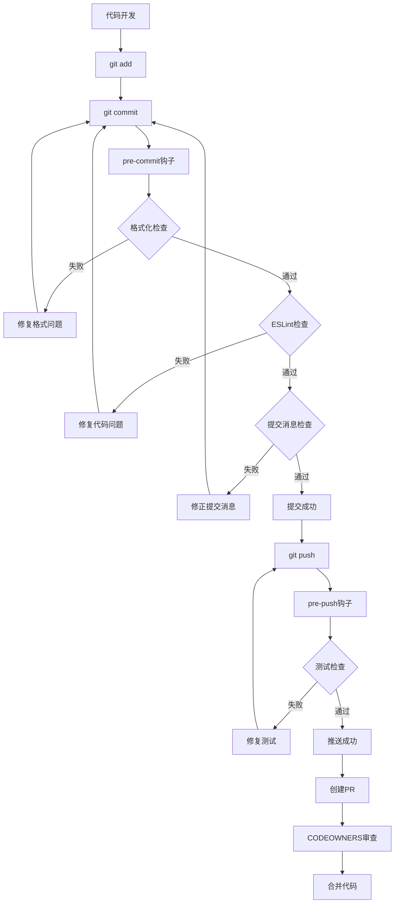

## 1. Product Overview

PR-12代码规范和质量控制系统旨在为古灵通monorepo项目建立统一的代码质量标准和自动化检查流程。通过ESLint/Prettier配置对齐、Git钩子集成、提交规范约束和代码审查责任制，确保代码库的一致性、可维护性和团队协作效率。

该系统解决了多包项目中代码风格不统一、提交信息混乱、代码质量参差不齐的问题，为开发团队提供自动化的代码质量保障机制。

## 2. Core Features

### 2.1 User Roles

| Role       | Registration Method | Core Permissions                       |
| ---------- | ------------------- | -------------------------------------- |
| 开发者     | Git仓库访问权限     | 提交代码、触发钩子检查、查看质量报告   |
| 代码审查者 | CODEOWNERS配置指定  | 审查指定目录代码、批准合并请求         |
| 项目维护者 | 仓库管理员权限      | 配置规范规则、管理钩子、更新CODEOWNERS |

### 2.2 Feature Module

我们的代码规范质量控制系统包含以下主要功能模块：

1. **ESLint/Prettier统一配置模块**：跨包配置同步、规则继承、自定义扩展
2. **Git钩子集成模块**：pre-commit格式化检查、pre-push测试验证、钩子管理
3. **提交规范模块**：conventional commits验证、提交消息模板、规范检查
4. **代码审查责任模块**：CODEOWNERS配置、审查流程、责任分配
5. **质量监控模块**：质量指标统计、违规报告、趋势分析

### 2.3 Page Details

| Page Name    | Module Name         | Feature description                                                                                |
| ------------ | ------------------- | -------------------------------------------------------------------------------------------------- |
| 配置管理页面 | ESLint/Prettier配置 | 管理各包的ESLint和Prettier配置文件，支持规则继承和自定义扩展。包括配置同步、规则验证、冲突检测     |
| 钩子管理页面 | Git钩子集成         | 配置和管理Git钩子脚本，包括pre-commit格式化检查、pre-push测试验证。支持钩子启用/禁用、执行日志查看 |
| 提交规范页面 | Commitlint配置      | 设置conventional commits规范，包括提交类型定义、作用域配置、消息模板。支持规范验证和违规统计       |
| 审查责任页面 | CODEOWNERS管理      | 配置代码审查责任分配，包括目录责任人设置、审查规则定义、权限管理。支持责任矩阵可视化               |
| 质量监控页面 | 质量指标统计        | 展示代码质量指标和趋势，包括ESLint违规统计、提交规范遵循率、审查通过率。支持报告导出和告警设置     |

## 3. Core Process

### 开发者工作流程

1. 开发者在本地进行代码开发
2. 执行git add添加文件到暂存区
3. 执行git commit触发pre-commit钩子
4. 钩子自动执行代码格式化和ESLint检查
5. 检查通过后验证提交消息是否符合conventional commits规范
6. 提交成功后，执行git push触发pre-push钩子
7. 钩子执行单元测试和类型检查
8. 所有检查通过后代码推送到远程仓库

### 代码审查流程

1. 开发者创建Pull Request
2. 系统根据CODEOWNERS自动分配审查者
3. 审查者收到通知并进行代码审查
4. 审查者提供反馈或批准合并
5. 所有必需审查者批准后允许合并
6. 合并后触发质量指标更新

## 4. User Interface Design

### 4.1 Design Style

- **主色调**：#1890ff（蓝色主题），#52c41a（成功绿色），#ff4d4f（错误红色）
- **按钮样式**：圆角按钮，支持主要、次要、危险三种类型
- **字体**：系统默认字体栈，代码区域使用等宽字体 'Monaco', 'Consolas'
- **布局风格**：卡片式布局，左侧导航，顶部面包屑导航
- **图标风格**：使用Ant Design图标库，线性风格图标

### 4.2 Page Design Overview

| Page Name    | Module Name         | UI Elements                                                                     |
| ------------ | ------------------- | ------------------------------------------------------------------------------- |
| 配置管理页面 | ESLint/Prettier配置 | 配置文件编辑器（Monaco Editor），规则树形展示，配置同步状态指示器，验证结果面板 |
| 钩子管理页面 | Git钩子集成         | 钩子状态卡片，执行日志终端样式展示，开关控件，配置表单                          |
| 提交规范页面 | Commitlint配置      | 规范规则配置表单，提交消息预览器，违规统计图表，模板编辑器                      |
| 审查责任页面 | CODEOWNERS管理      | 目录树形结构，责任人标签，权限矩阵表格，可视化责任图                            |
| 质量监控页面 | 质量指标统计        | 指标卡片，趋势图表（Recharts），违规列表，导出按钮                              |

### 4.3 Responsiveness

系统采用桌面优先设计，主要面向开发者和项目管理者使用。支持1920x1080及以上分辨率的最佳体验，在1366x768分辨率下保持良好可用性。不考虑移动端适配，专注于桌面端的专业工具体验。
