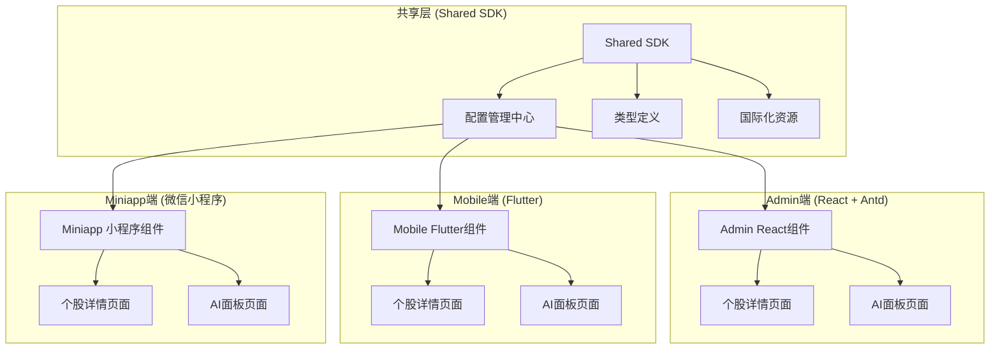
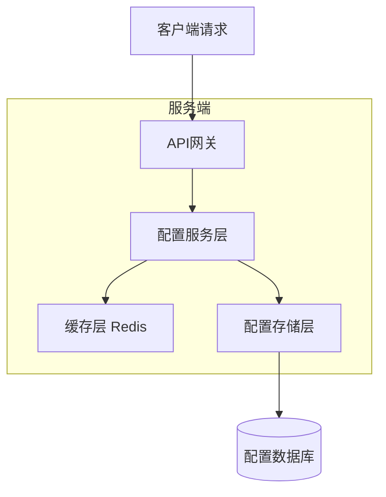
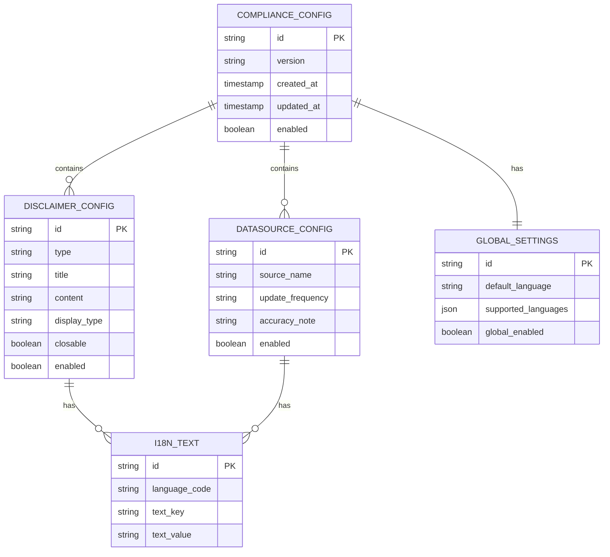

# PR-09 合规声明组件技术架构文档

## 1. 架构设计



## 2. 技术描述

- **共享层**: TypeScript + 配置管理 + 国际化资源
- **Admin端**: React@18 + Antd@5 + TypeScript
- **Mobile端**: Flutter@3.x + Dart
- **Miniapp端**: 微信小程序原生 + JavaScript
- **配置存储**: JSON配置文件 + 本地缓存

## 3. 路由定义

| 路由                         | 用途                                 |
| ---------------------------- | ------------------------------------ |
| /admin/dashboard/stocks/:id  | Admin端个股详情页，底部显示合规声明  |
| /admin/dashboard/ai          | Admin端AI面板页，底部显示AI声明      |
| /mobile/stock/detail         | Mobile端个股详情页，底部固定显示声明 |
| /mobile/ai/panel             | Mobile端AI面板页，底部固定显示声明   |
| /miniapp/pages/market/detail | 小程序个股详情页，底部显示声明       |
| /miniapp/pages/ai/ai         | 小程序AI页面，底部显示声明           |

## 4. API定义

### 4.1 核心API

配置管理相关

```
GET /api/compliance/config
```

Request: 无参数

Response:
| 参数名称 | 参数类型 | 描述 |
|---------|---------|------|
| disclaimers | object | 免责声明配置 |
| dataSourceHints | object | 数据来源提示配置 |
| globalSettings | object | 全局设置 |
| i18n | object | 国际化资源 |

Example:

```json
{
  "disclaimers": {
    "investment": {
      "enabled": true,
      "title": "投资风险提示",
      "content": "本平台提供的信息仅供参考，不构成投资建议。投资有风险，决策需谨慎。",
      "type": "warning",
      "closable": true
    },
    "ai": {
      "enabled": true,
      "title": "AI分析声明",
      "content": "AI分析结果仅供参考，不保证准确性，请结合多方信息独立判断。",
      "type": "info",
      "closable": false
    }
  },
  "dataSourceHints": {
    "stock": {
      "enabled": true,
      "source": "上海证券交易所、深圳证券交易所",
      "updateFrequency": "实时更新，可能存在15分钟延迟",
      "accuracy": "数据仅供参考，请以官方数据为准"
    }
  },
  "globalSettings": {
    "enabled": true,
    "defaultLanguage": "zh-CN",
    "supportedLanguages": ["zh-CN", "en-US"]
  }
}
```

更新配置

```
PUT /api/compliance/config
```

Request:
| 参数名称 | 参数类型 | 是否必需 | 描述 |
|---------|---------|---------|------|
| config | object | true | 完整的配置对象 |

Response:
| 参数名称 | 参数类型 | 描述 |
|---------|---------|------|
| success | boolean | 更新是否成功 |
| message | string | 响应消息 |

## 5. 服务架构图



## 6. 数据模型

### 6.1 数据模型定义



### 6.2 数据定义语言

配置表 (compliance_configs)

```sql
-- 创建配置表
CREATE TABLE compliance_configs (
    id UUID PRIMARY KEY DEFAULT gen_random_uuid(),
    version VARCHAR(20) NOT NULL DEFAULT '1.0.0',
    created_at TIMESTAMP WITH TIME ZONE DEFAULT NOW(),
    updated_at TIMESTAMP WITH TIME ZONE DEFAULT NOW(),
    enabled BOOLEAN DEFAULT true
);

-- 免责声明配置表
CREATE TABLE disclaimer_configs (
    id UUID PRIMARY KEY DEFAULT gen_random_uuid(),
    config_id UUID REFERENCES compliance_configs(id),
    type VARCHAR(50) NOT NULL, -- 'investment', 'ai', 'data', 'full'
    title VARCHAR(200) NOT NULL,
    content TEXT NOT NULL,
    display_type VARCHAR(20) DEFAULT 'warning', -- 'warning', 'info', 'error'
    closable BOOLEAN DEFAULT true,
    enabled BOOLEAN DEFAULT true,
    created_at TIMESTAMP WITH TIME ZONE DEFAULT NOW()
);

-- 数据来源配置表
CREATE TABLE datasource_configs (
    id UUID PRIMARY KEY DEFAULT gen_random_uuid(),
    config_id UUID REFERENCES compliance_configs(id),
    source_name VARCHAR(200) NOT NULL,
    update_frequency VARCHAR(200),
    accuracy_note TEXT,
    enabled BOOLEAN DEFAULT true,
    created_at TIMESTAMP WITH TIME ZONE DEFAULT NOW()
);

-- 全局设置表
CREATE TABLE global_settings (
    id UUID PRIMARY KEY DEFAULT gen_random_uuid(),
    config_id UUID REFERENCES compliance_configs(id),
    default_language VARCHAR(10) DEFAULT 'zh-CN',
    supported_languages JSON DEFAULT '["zh-CN", "en-US"]',
    global_enabled BOOLEAN DEFAULT true
);

-- 国际化文本表
CREATE TABLE i18n_texts (
    id UUID PRIMARY KEY DEFAULT gen_random_uuid(),
    language_code VARCHAR(10) NOT NULL,
    text_key VARCHAR(100) NOT NULL,
    text_value TEXT NOT NULL,
    created_at TIMESTAMP WITH TIME ZONE DEFAULT NOW(),
    UNIQUE(language_code, text_key)
);

-- 创建索引
CREATE INDEX idx_disclaimer_configs_type ON disclaimer_configs(type);
CREATE INDEX idx_disclaimer_configs_enabled ON disclaimer_configs(enabled);
CREATE INDEX idx_datasource_configs_enabled ON datasource_configs(enabled);
CREATE INDEX idx_i18n_texts_language ON i18n_texts(language_code);
CREATE INDEX idx_i18n_texts_key ON i18n_texts(text_key);

-- 初始化数据
INSERT INTO compliance_configs (id, version, enabled)
VALUES ('default-config-001', '1.0.0', true);

INSERT INTO disclaimer_configs (config_id, type, title, content, display_type, closable, enabled)
VALUES
('default-config-001', 'investment', '投资风险提示', '本平台提供的信息仅供参考，不构成投资建议。投资有风险，决策需谨慎。', 'warning', true, true),
('default-config-001', 'ai', 'AI分析声明', 'AI分析结果仅供参考，不保证准确性，请结合多方信息独立判断。', 'info', false, true),
('default-config-001', 'data', '数据声明', '数据可能存在延迟，请以官方数据为准。', 'warning', true, true);

INSERT INTO datasource_configs (config_id, source_name, update_frequency, accuracy_note, enabled)
VALUES
('default-config-001', '上海证券交易所、深圳证券交易所', '实时更新，可能存在15分钟延迟', '数据仅供参考，请以官方数据为准', true);

INSERT INTO global_settings (config_id, default_language, supported_languages, global_enabled)
VALUES
('default-config-001', 'zh-CN', '["zh-CN", "en-US"]', true);

INSERT INTO i18n_texts (language_code, text_key, text_value)
VALUES
('zh-CN', 'disclaimer.investment.title', '投资风险提示'),
('zh-CN', 'disclaimer.investment.content', '本平台提供的信息仅供参考，不构成投资建议。投资有风险，决策需谨慎。'),
('en-US', 'disclaimer.investment.title', 'Investment Risk Warning'),
('en-US', 'disclaimer.investment.content', 'The information provided on this platform is for reference only and does not constitute investment advice. Investment involves risks, please make decisions carefully.');
```
