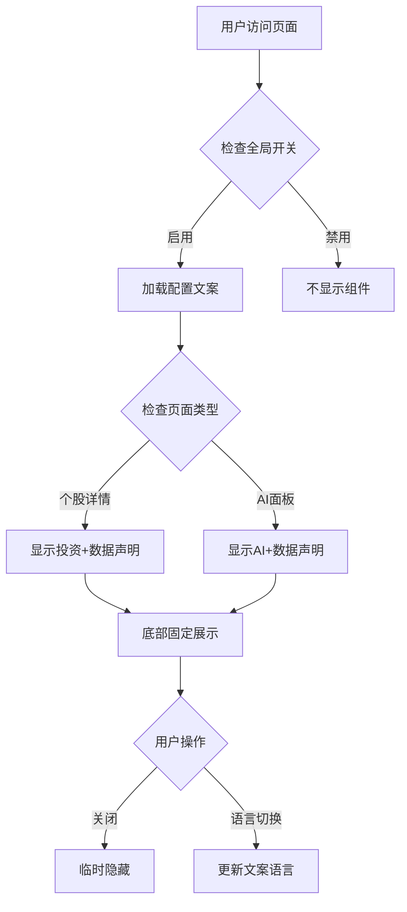

# PR-09 合规声明组件产品需求文档

## 1. 产品概述

本需求旨在为古灵通股票投资平台三端应用（Admin管理端、Mobile移动端、Miniapp小程序）创建统一的合规声明组件，包括免责声明（Disclaimer）和数据来源提示（DataSourceHint）组件。

- 解决合规要求：满足金融投资平台的法律合规要求，为用户提供必要的风险提示和数据声明
- 统一用户体验：确保三端应用的合规声明展示一致性和专业性
- 提升平台价值：通过规范的合规声明提升平台的专业度和可信度

## 2. 核心功能

### 2.1 用户角色

本功能面向所有平台用户，无需区分角色权限。

### 2.2 功能模块

本需求包含以下核心页面和组件：

1. **Disclaimer组件**: 投资风险声明、AI分析声明、数据免责声明
2. **DataSourceHint组件**: 数据来源说明、更新频率提示、准确性声明
3. **配置管理**: 文案配置中心、国际化支持、全局开关控制
4. **集成页面**: 个股详情页底部固定展示、AI面板底部固定展示

### 2.3 页面详情

| 页面名称           | 模块名称     | 功能描述                                                         |
| ------------------ | ------------ | ---------------------------------------------------------------- |
| Disclaimer组件     | 投资风险声明 | 显示投资有风险的法律声明，支持不同类型（投资、数据、AI、完整版） |
| Disclaimer组件     | 样式配置     | 支持警告、信息、错误等不同样式，可配置图标、关闭按钮             |
| DataSourceHint组件 | 数据来源说明 | 显示股票数据来源、更新频率、延迟说明                             |
| DataSourceHint组件 | 准确性声明   | 提示数据仅供参考，以官方数据为准                                 |
| 配置管理中心       | 文案配置     | 集中管理所有声明文案，支持动态更新                               |
| 配置管理中心       | 国际化支持   | 支持中英文切换，可扩展其他语言                                   |
| 配置管理中心       | 全局开关     | 支持全局控制组件显示/隐藏，支持页面级别控制                      |
| 个股详情页         | 底部固定展示 | 在个股详情页面底部固定显示合规声明                               |
| AI面板页面         | 底部固定展示 | 在AI分析面板底部固定显示AI声明和数据声明                         |

## 3. 核心流程

### 3.1 组件显示流程

用户访问个股详情页或AI面板时，系统自动检查全局开关配置，如果启用则在页面底部固定显示相应的合规声明组件。用户可以通过关闭按钮临时隐藏声明（如果配置允许）。

### 3.2 配置管理流程

管理员通过配置管理中心设置声明文案、语言版本和显示开关。配置更新后实时生效，无需重启应用。

## 4. 用户界面设计

### 4.1 设计风格

- **主色调**: 警告橙色 #FF8C00，信息蓝色 #1890FF
- **辅助色**: 背景浅黄 #FFF7E6，边框浅橙 #FFD666
- **按钮样式**: 圆角按钮，支持关闭图标
- **字体**: 系统默认字体，声明文字 12-14px，标题 16px
- **布局风格**: 卡片式设计，底部固定定位
- **图标风格**: 使用警告、信息、数据源等语义化图标

### 4.2 页面设计概览

| 页面名称           | 模块名称     | UI元素                                                           |
| ------------------ | ------------ | ---------------------------------------------------------------- |
| Disclaimer组件     | 投资声明     | 警告图标、橙色背景、"投资有风险"标题、详细说明文字、可选关闭按钮 |
| Disclaimer组件     | AI声明       | 信息图标、蓝色背景、"AI分析声明"标题、准确性说明、参考提示       |
| DataSourceHint组件 | 数据来源     | 数据图标、灰色背景、数据源名称、更新频率、延迟说明               |
| DataSourceHint组件 | 准确性提示   | 提示图标、浅色背景、"仅供参考"文字、官方数据提醒                 |
| 个股详情页         | 底部固定区域 | 半透明背景、投资声明+数据提示、固定在页面底部、不遮挡主要内容    |
| AI面板页面         | 底部固定区域 | 半透明背景、AI声明+数据提示、固定在面板底部、可收起展开          |

### 4.3 响应式设计

- **桌面端优先**: Admin管理端采用桌面优先设计，支持大屏显示
- **移动端适配**: Mobile和Miniapp采用移动端优先，支持触摸操作
- **跨端一致性**: 保持三端视觉风格和交互逻辑的一致性
- **自适应布局**: 根据屏幕尺寸自动调整组件大小和布局
