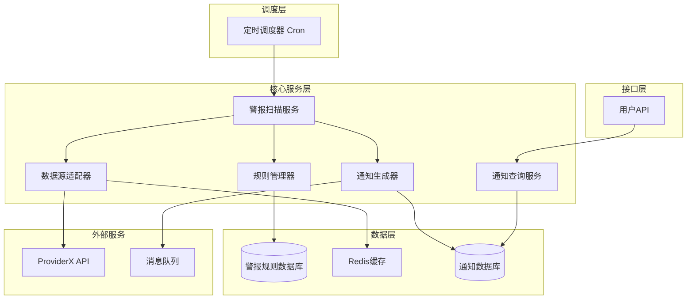
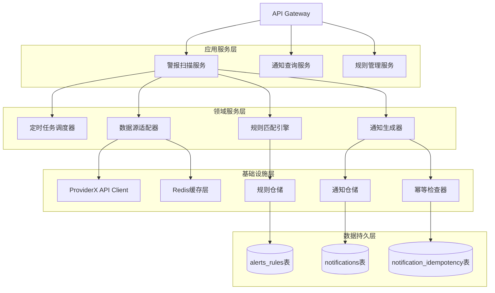
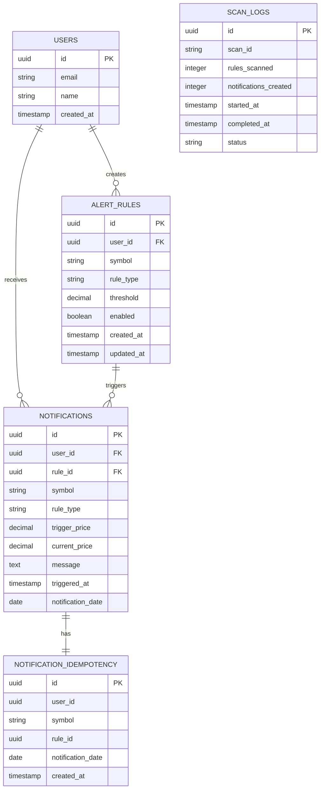

# PR-10 警报引擎扫描系统技术架构文档

## 1. 架构设计



## 2. 技术描述

- **后端框架**: Next.js@14 + TypeScript
- **数据库**: Supabase (PostgreSQL)
- **缓存**: Redis (股价数据缓存)
- **定时任务**: node-cron + 手动触发接口
- **数据源**: ProviderX API集成
- **消息队列**: 内存队列 (可扩展为Redis Queue)
- **测试框架**: Jest + Supertest

## 3. 路由定义

| 路由                         | 用途                             |
| ---------------------------- | -------------------------------- |
| GET /api/me/notifications    | 获取用户通知列表，支持分页和筛选 |
| POST /api/alerts/scan        | 手动触发警报扫描任务             |
| GET /api/alerts/rules        | 获取用户警报规则列表             |
| POST /api/alerts/rules       | 创建新的警报规则                 |
| PUT /api/alerts/rules/:id    | 更新警报规则                     |
| DELETE /api/alerts/rules/:id | 删除警报规则                     |
| GET /api/alerts/status       | 获取扫描任务状态和统计信息       |

## 4. API定义

### 4.1 核心API

获取用户通知

```
GET /api/me/notifications
```

Request:
| 参数名称 | 参数类型 | 是否必需 | 描述 |
|---------|---------|---------|------|
| page | number | false | 页码，默认1 |
| limit | number | false | 每页数量，默认20 |
| symbol | string | false | 股票代码筛选 |
| startDate | string | false | 开始日期 (YYYY-MM-DD) |
| endDate | string | false | 结束日期 (YYYY-MM-DD) |

Response:
| 参数名称 | 参数类型 | 描述 |
|---------|---------|------|
| notifications | array | 通知列表 |
| total | number | 总数量 |
| page | number | 当前页码 |
| totalPages | number | 总页数 |

Example:

```json
{
  "notifications": [
    {
      "id": "uuid",
      "userId": "user-uuid",
      "symbol": "AAPL",
      "ruleId": "rule-uuid",
      "ruleType": "price_above",
      "triggerPrice": 150.0,
      "currentPrice": 152.5,
      "message": "AAPL股价已突破150.00，当前价格152.50",
      "triggeredAt": "2024-01-15T10:30:00Z",
      "notificationDate": "2024-01-15"
    }
  ],
  "total": 25,
  "page": 1,
  "totalPages": 2
}
```

手动触发扫描

```
POST /api/alerts/scan
```

Request: 无参数

Response:
| 参数名称 | 参数类型 | 描述 |
|---------|---------|------|
| success | boolean | 扫描是否成功启动 |
| scanId | string | 扫描任务ID |
| message | string | 响应消息 |

Example:

```json
{
  "success": true,
  "scanId": "scan-20240115-103000",
  "message": "警报扫描任务已启动"
}
```

创建警报规则

```
POST /api/alerts/rules
```

Request:
| 参数名称 | 参数类型 | 是否必需 | 描述 |
|---------|---------|---------|------|
| symbol | string | true | 股票代码 |
| ruleType | string | true | 规则类型: price_above, price_below, price_change |
| threshold | number | true | 触发阈值 |
| enabled | boolean | false | 是否启用，默认true |

Response:
| 参数名称 | 参数类型 | 描述 |
|---------|---------|------|
| rule | object | 创建的规则对象 |
| success | boolean | 创建是否成功 |

## 5. 服务架构图



## 6. 数据模型

### 6.1 数据模型定义



### 6.2 数据定义语言

警报规则表 (alert_rules)

```sql
-- 创建警报规则表
CREATE TABLE alert_rules (
    id UUID PRIMARY KEY DEFAULT gen_random_uuid(),
    user_id UUID NOT NULL,
    symbol VARCHAR(20) NOT NULL,
    rule_type VARCHAR(50) NOT NULL, -- 'price_above', 'price_below', 'price_change'
    threshold DECIMAL(10,2) NOT NULL,
    enabled BOOLEAN DEFAULT true,
    created_at TIMESTAMP WITH TIME ZONE DEFAULT NOW(),
    updated_at TIMESTAMP WITH TIME ZONE DEFAULT NOW()
);

-- 通知表 (notifications)
CREATE TABLE notifications (
    id UUID PRIMARY KEY DEFAULT gen_random_uuid(),
    user_id UUID NOT NULL,
    rule_id UUID NOT NULL REFERENCES alert_rules(id),
    symbol VARCHAR(20) NOT NULL,
    rule_type VARCHAR(50) NOT NULL,
    trigger_price DECIMAL(10,2) NOT NULL,
    current_price DECIMAL(10,2) NOT NULL,
    message TEXT NOT NULL,
    triggered_at TIMESTAMP WITH TIME ZONE DEFAULT NOW(),
    notification_date DATE DEFAULT CURRENT_DATE
);

-- 通知幂等表 (notification_idempotency)
CREATE TABLE notification_idempotency (
    id UUID PRIMARY KEY DEFAULT gen_random_uuid(),
    user_id UUID NOT NULL,
    symbol VARCHAR(20) NOT NULL,
    rule_id UUID NOT NULL,
    notification_date DATE NOT NULL,
    created_at TIMESTAMP WITH TIME ZONE DEFAULT NOW(),
    UNIQUE(user_id, symbol, rule_id, notification_date)
);

-- 扫描日志表 (scan_logs)
CREATE TABLE scan_logs (
    id UUID PRIMARY KEY DEFAULT gen_random_uuid(),
    scan_id VARCHAR(100) NOT NULL,
    rules_scanned INTEGER DEFAULT 0,
    notifications_created INTEGER DEFAULT 0,
    started_at TIMESTAMP WITH TIME ZONE DEFAULT NOW(),
    completed_at TIMESTAMP WITH TIME ZONE,
    status VARCHAR(20) DEFAULT 'running' -- 'running', 'completed', 'failed'
);

-- 创建索引
CREATE INDEX idx_alert_rules_user_id ON alert_rules(user_id);
CREATE INDEX idx_alert_rules_symbol ON alert_rules(symbol);
CREATE INDEX idx_alert_rules_enabled ON alert_rules(enabled);
CREATE INDEX idx_notifications_user_id ON notifications(user_id);
CREATE INDEX idx_notifications_symbol ON notifications(symbol);
CREATE INDEX idx_notifications_date ON notifications(notification_date DESC);
CREATE INDEX idx_notification_idempotency_composite ON notification_idempotency(user_id, symbol, rule_id, notification_date);
CREATE INDEX idx_scan_logs_scan_id ON scan_logs(scan_id);
CREATE INDEX idx_scan_logs_started_at ON scan_logs(started_at DESC);

-- 初始化测试数据
INSERT INTO alert_rules (user_id, symbol, rule_type, threshold, enabled)
VALUES
('user-test-001', 'AAPL', 'price_above', 150.00, true),
('user-test-001', 'GOOGL', 'price_below', 2800.00, true),
('user-test-002', 'TSLA', 'price_above', 200.00, true),
('user-test-002', 'MSFT', 'price_change', 5.00, false);

-- 权限设置
GRANT SELECT, INSERT, UPDATE ON alert_rules TO authenticated;
GRANT SELECT, INSERT ON notifications TO authenticated;
GRANT SELECT, INSERT ON notification_idempotency TO authenticated;
GRANT SELECT ON scan_logs TO authenticated;
GRANT ALL PRIVILEGES ON alert_rules TO service_role;
GRANT ALL PRIVILEGES ON notifications TO service_role;
GRANT ALL PRIVILEGES ON notification_idempotency TO service_role;
GRANT ALL PRIVILEGES ON scan_logs TO service_role;
```

## 7. 定时任务设计

### 7.1 Cron任务配置

```typescript
// 每5分钟执行一次扫描
const SCAN_SCHEDULE = '*/5 * * * *';

// 定时任务实现
import cron from 'node-cron';

cron.schedule(SCAN_SCHEDULE, async () => {
  console.log('开始执行警报扫描任务');
  await executeAlertScan();
});
```

### 7.2 扫描算法

```typescript
async function executeAlertScan() {
  const scanId = `scan-${Date.now()}`;

  try {
    // 1. 记录扫描开始
    await logScanStart(scanId);

    // 2. 获取所有启用的规则
    const activeRules = await getActiveAlertRules();

    // 3. 按股票代码分组，减少API调用
    const symbolGroups = groupRulesBySymbol(activeRules);

    let totalNotifications = 0;

    // 4. 遍历每个股票代码
    for (const symbol of Object.keys(symbolGroups)) {
      // 5. 获取当前股价
      const currentPrice = await getStockPrice(symbol);

      // 6. 检查该股票的所有规则
      const rules = symbolGroups[symbol];
      for (const rule of rules) {
        if (checkRuleMatch(rule, currentPrice)) {
          // 7. 规则命中，检查幂等性
          const notificationCreated = await createNotificationIfNotExists(
            rule,
            currentPrice
          );
          if (notificationCreated) {
            totalNotifications++;
          }
        }
      }
    }

    // 8. 记录扫描完成
    await logScanComplete(scanId, activeRules.length, totalNotifications);
  } catch (error) {
    await logScanError(scanId, error);
  }
}
```

## 8. 幂等机制设计

### 8.1 幂等键设计

```typescript
// 幂等键组成：user_id + symbol + rule_id + notification_date
function generateIdempotencyKey(
  userId: string,
  symbol: string,
  ruleId: string,
  date: string = new Date().toISOString().split('T')[0]
): string {
  return `${userId}:${symbol}:${ruleId}:${date}`;
}
```

### 8.2 幂等检查实现

```typescript
async function createNotificationIfNotExists(
  rule: AlertRule,
  currentPrice: number
): Promise<boolean> {
  const today = new Date().toISOString().split('T')[0];

  // 检查今日是否已通知
  const existingIdempotency = await supabase
    .from('notification_idempotency')
    .select('id')
    .eq('user_id', rule.user_id)
    .eq('symbol', rule.symbol)
    .eq('rule_id', rule.id)
    .eq('notification_date', today)
    .single();

  if (existingIdempotency.data) {
    return false; // 今日已通知，跳过
  }

  // 使用事务确保原子性
  const { error } = await supabase.rpc('create_notification_with_idempotency', {
    p_user_id: rule.user_id,
    p_rule_id: rule.id,
    p_symbol: rule.symbol,
    p_rule_type: rule.rule_type,
    p_trigger_price: rule.threshold,
    p_current_price: currentPrice,
    p_message: generateNotificationMessage(rule, currentPrice),
    p_notification_date: today,
  });

  return !error;
}
```

## 9. 测试策略

### 9.1 单元测试覆盖

```typescript
// 测试规则匹配逻辑
describe('Rule Matching', () => {
  test('price_above rule should trigger when current price exceeds threshold', () => {
    const rule = { rule_type: 'price_above', threshold: 100 };
    expect(checkRuleMatch(rule, 105)).toBe(true);
    expect(checkRuleMatch(rule, 95)).toBe(false);
  });
});

// 测试幂等机制
describe('Notification Idempotency', () => {
  test('should not create duplicate notifications for same day', async () => {
    // 第一次创建通知
    const created1 = await createNotificationIfNotExists(mockRule, 105);
    expect(created1).toBe(true);

    // 同一天再次尝试创建
    const created2 = await createNotificationIfNotExists(mockRule, 106);
    expect(created2).toBe(false);
  });
});
```

### 9.2 集成测试

```typescript
// 测试完整扫描流程
describe('Alert Scan Integration', () => {
  test('should complete full scan cycle', async () => {
    // 准备测试数据
    await setupTestRules();

    // 执行扫描
    const result = await executeAlertScan();

    // 验证结果
    expect(result.success).toBe(true);
    expect(result.notificationsCreated).toBeGreaterThan(0);

    // 验证通知已创建
    const notifications = await getNotifications();
    expect(notifications.length).toBeGreaterThan(0);
  });
});
```
