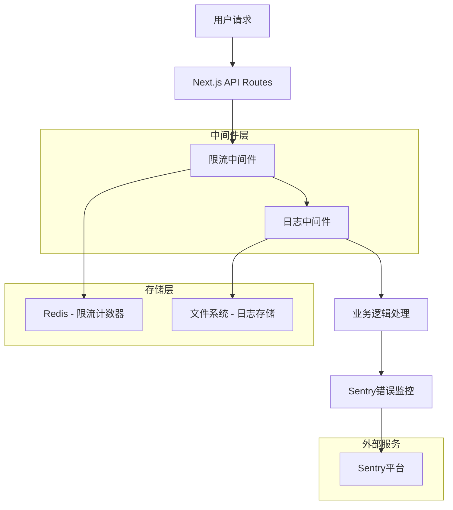
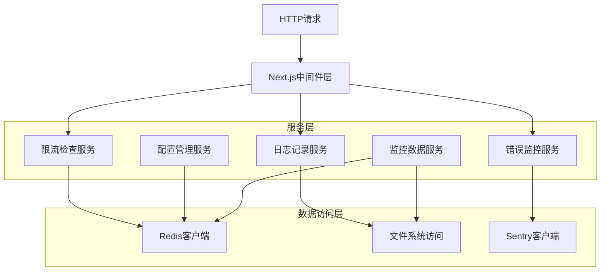
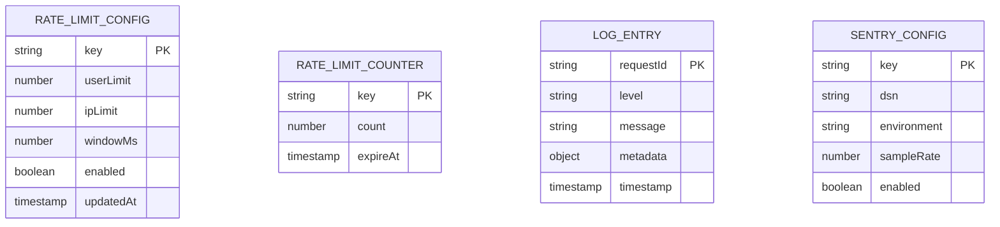

# PR-11 安全、限流、日志和Sentry集成技术架构文档

## 1. 架构设计



## 2. 技术描述

- Frontend: Next.js@14 + TypeScript + Tailwind CSS
- Backend: Next.js API Routes + 中间件
- 限流存储: Redis@7 (计数器和配额管理)
- 日志系统: Pino@8 (结构化日志)
- 错误监控: @sentry/nextjs@7
- 限流库: express-rate-limit + rate-limit-redis

## 3. 路由定义

| 路由                  | 用途                       |
| --------------------- | -------------------------- |
| /api/ai/\*            | AI相关接口，需要限流保护   |
| /api/market/\*        | 市场数据接口，需要限流保护 |
| /api/admin/rate-limit | 限流配置管理接口           |
| /api/admin/logs       | 日志查询接口               |
| /api/admin/monitoring | 监控数据接口               |

## 4. API定义

### 4.1 核心API

#### 限流配置管理

```
GET /api/admin/rate-limit/config
```

Response:
| 参数名 | 参数类型 | 描述 |
|--------|----------|------|
| userLimit | number | 用户限流配额（每分钟请求数） |
| ipLimit | number | IP限流配额（每分钟请求数） |
| windowMs | number | 时间窗口（毫秒） |
| enabled | boolean | 限流是否启用 |

示例:

```json
{
  "userLimit": 100,
  "ipLimit": 50,
  "windowMs": 60000,
  "enabled": true
}
```

#### 限流状态查询

```
GET /api/admin/rate-limit/status
```

Request:
| 参数名 | 参数类型 | 是否必需 | 描述 |
|--------|----------|----------|------|
| userId | string | false | 查询特定用户的限流状态 |
| ip | string | false | 查询特定IP的限流状态 |

Response:
| 参数名 | 参数类型 | 描述 |
|--------|----------|------|
| current | number | 当前时间窗口内的请求数 |
| limit | number | 限流配额 |
| remaining | number | 剩余可用请求数 |
| resetTime | number | 限流重置时间戳 |

#### 日志查询

```
GET /api/admin/logs
```

Request:
| 参数名 | 参数类型 | 是否必需 | 描述 |
|--------|----------|----------|------|
| requestId | string | false | 请求ID，用于链路追踪 |
| level | string | false | 日志级别 (info, warn, error) |
| startTime | string | false | 开始时间 (ISO格式) |
| endTime | string | false | 结束时间 (ISO格式) |
| limit | number | false | 返回条数限制，默认100 |

Response:
| 参数名 | 参数类型 | 描述 |
|--------|----------|------|
| logs | array | 日志条目数组 |
| total | number | 总条数 |
| hasMore | boolean | 是否有更多数据 |

#### Sentry配置

```
POST /api/admin/sentry/config
```

Request:
| 参数名 | 参数类型 | 是否必需 | 描述 |
|--------|----------|----------|------|
| dsn | string | false | Sentry DSN，留空则禁用 |
| environment | string | false | 环境标识 |
| sampleRate | number | false | 采样率 (0-1) |

Response:
| 参数名 | 参数类型 | 描述 |
|--------|----------|------|
| success | boolean | 配置是否成功 |
| enabled | boolean | Sentry是否启用 |

## 5. 服务器架构图



## 6. 数据模型

### 6.1 数据模型定义



### 6.2 数据定义语言

#### Redis数据结构

```bash
# 限流计数器 (String类型，带过期时间)
KEY: rate_limit:user:{userId}:{endpoint}
VALUE: {count}
TTL: {windowMs}

KEY: rate_limit:ip:{ipAddress}:{endpoint}
VALUE: {count}
TTL: {windowMs}

# 限流配置 (Hash类型)
KEY: rate_limit:config
FIELDS:
  userLimit: 100
  ipLimit: 50
  windowMs: 60000
  enabled: true

# Sentry配置 (Hash类型)
KEY: sentry:config
FIELDS:
  dsn: "https://..."
  environment: "production"
  sampleRate: 1.0
  enabled: true
```

#### 日志文件结构

```bash
# 日志文件路径
logs/
├── app.log              # 应用日志
├── access.log           # 访问日志
├── error.log            # 错误日志
└── rate-limit.log       # 限流日志

# 日志格式 (JSON)
{
  "level": "info",
  "time": "2024-01-15T10:30:00.000Z",
  "requestId": "req_123456789",
  "userId": "user_123",
  "ip": "192.168.1.1",
  "method": "GET",
  "url": "/api/ai/chat",
  "statusCode": 200,
  "responseTime": 150,
  "userAgent": "Mozilla/5.0...",
  "message": "Request completed"
}
```

#### 中间件配置

```typescript
// 限流中间件配置
interface RateLimitConfig {
  userLimit: number; // 用户限流配额
  ipLimit: number; // IP限流配额
  windowMs: number; // 时间窗口
  skipSuccessfulRequests: boolean;
  skipFailedRequests: boolean;
  keyGenerator: (req: Request) => string;
}

// 日志中间件配置
interface LoggingConfig {
  level: 'debug' | 'info' | 'warn' | 'error';
  prettyPrint: boolean;
  redact: string[]; // 需要脱敏的字段
  serializers: object;
}

// Sentry配置
interface SentryConfig {
  dsn?: string;
  environment: string;
  sampleRate: number;
  tracesSampleRate: number;
  beforeSend?: (event: any) => any;
}
```

#### 环境变量配置

```bash
# Redis配置
REDIS_URL=redis://localhost:6379
REDIS_PASSWORD=

# 限流配置
RATE_LIMIT_USER_LIMIT=100
RATE_LIMIT_IP_LIMIT=50
RATE_LIMIT_WINDOW_MS=60000
RATE_LIMIT_ENABLED=true

# 日志配置
LOG_LEVEL=info
LOG_PRETTY_PRINT=false
LOG_FILE_PATH=./logs

# Sentry配置
SENTRY_DSN=
SENTRY_ENVIRONMENT=production
SENTRY_SAMPLE_RATE=1.0
SENTRY_TRACES_SAMPLE_RATE=0.1
```
