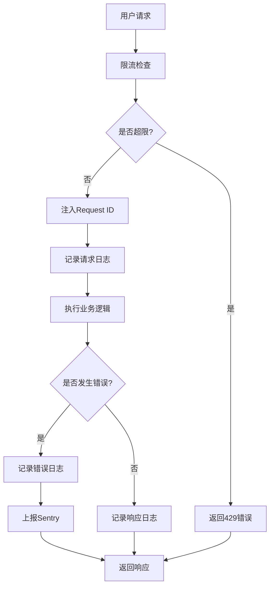

# PR-11 安全、限流、日志和Sentry集成需求文档

## 1. 产品概述

本需求旨在为古灵通API服务增强安全性、可观测性和错误监控能力，通过实现API限流、结构化日志和Sentry集成，提升系统的稳定性和可维护性。

- 核心目标：保护关键API接口免受滥用，建立完善的日志追踪体系，集成错误监控平台
- 适用范围：主要针对AI相关接口(/api/ai/_)和市场数据接口(/api/market/_)进行限流保护
- 业务价值：降低系统风险，提升问题排查效率，增强系统可观测性

## 2. 核心功能

### 2.1 用户角色

| 角色       | 识别方式   | 核心权限             |
| ---------- | ---------- | -------------------- |
| 认证用户   | JWT Token  | 基于用户ID的限流配额 |
| 匿名用户   | IP地址     | 基于IP的限流配额     |
| 系统管理员 | 管理员权限 | 查看限流状态和日志   |

### 2.2 功能模块

本系统包含以下核心页面和功能：

1. **API限流中间件**：请求频率控制、配额管理、429响应处理
2. **结构化日志系统**：请求追踪、性能监控、错误记录
3. **Sentry错误监控**：异常捕获、错误上报、性能监控
4. **管理监控面板**：限流状态查看、日志查询、错误统计

### 2.3 页面详情

| 页面名称       | 模块名称   | 功能描述                                           |
| -------------- | ---------- | -------------------------------------------------- |
| API限流中间件  | 用户限流   | 基于用户ID实现per-user限流，支持不同用户不同配额   |
| API限流中间件  | IP限流     | 基于IP地址实现per-ip限流，防止单一IP过度请求       |
| API限流中间件  | 配置管理   | 支持动态配置限流参数，包括时间窗口、请求次数限制   |
| API限流中间件  | 429响应    | 触发限流时返回429状态码和详细错误信息              |
| 结构化日志系统 | 请求ID注入 | 为每个请求生成唯一x-request-id，支持链路追踪       |
| 结构化日志系统 | Pino日志   | 使用pino库记录结构化日志，包含请求详情和性能指标   |
| 结构化日志系统 | 日志格式化 | 统一日志格式，包含时间戳、级别、请求ID、用户信息等 |
| Sentry错误监控 | 错误捕获   | 自动捕获未处理异常和错误，上报到Sentry平台         |
| Sentry错误监控 | 性能监控   | 监控API响应时间和性能指标                          |
| Sentry错误监控 | 配置管理   | 支持DSN配置，留空时自动禁用Sentry功能              |
| 管理监控面板   | 限流状态   | 显示当前限流状态、触发次数、用户配额使用情况       |
| 管理监控面板   | 日志查询   | 基于requestId查询相关日志，支持链路追踪            |
| 管理监控面板   | 错误统计   | 显示错误发生频率、类型分布、影响用户数等           |

## 3. 核心流程

### 用户请求处理流程

1. 用户发起API请求到/api/ai/_或/api/market/_
2. 限流中间件检查用户/IP请求频率
3. 如果超过限制，返回429状态码和错误信息
4. 如果通过限流检查，注入x-request-id到请求头
5. 记录结构化日志，包含请求详情和性能指标
6. 执行业务逻辑处理请求
7. 如果发生错误，自动上报到Sentry（如果已配置）
8. 返回响应结果，记录响应日志

### 错误处理和监控流程

1. 系统检测到异常或错误
2. 记录详细错误日志，包含requestId和上下文信息
3. 如果配置了Sentry DSN，自动上报错误到Sentry平台
4. 管理员可通过监控面板查看错误统计和详情
5. 基于requestId进行日志链路追踪，快速定位问题

## 4. 用户界面设计

### 4.1 设计风格

- 主色调：#2563eb（蓝色）用于正常状态，#dc2626（红色）用于错误和限流状态
- 辅助色：#10b981（绿色）用于成功状态，#f59e0b（橙色）用于警告
- 按钮样式：圆角按钮，支持hover和active状态
- 字体：系统默认字体，标题使用16px，正文使用14px，代码使用等宽字体
- 布局风格：卡片式布局，顶部导航，响应式设计
- 图标风格：使用Heroicons或类似的现代图标库

### 4.2 页面设计概览

| 页面名称       | 模块名称     | UI元素                                                               |
| -------------- | ------------ | -------------------------------------------------------------------- |
| 管理监控面板   | 限流状态卡片 | 显示当前限流配置、触发次数、用户配额使用情况，使用进度条和数字指标   |
| 管理监控面板   | 日志查询界面 | 搜索框支持requestId输入，结果以时间线形式展示，支持日志级别筛选      |
| 管理监控面板   | 错误统计图表 | 使用柱状图显示错误频率，饼图显示错误类型分布，表格显示详细错误列表   |
| 限流配置页面   | 配置表单     | 输入框设置时间窗口和请求限制，开关控制限流启用状态，实时预览配置效果 |
| Sentry配置页面 | DSN配置      | 文本输入框配置Sentry DSN，状态指示器显示连接状态，测试按钮验证配置   |

### 4.3 响应式设计

产品采用桌面优先设计，同时支持移动端适配。管理监控面板主要面向桌面用户，但在移动设备上会自动调整布局，将卡片式内容垂直排列，确保良好的触控体验。
