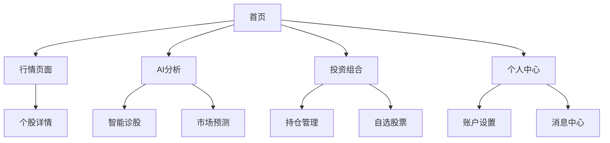

# 古灵通 (GuLingTong) 产品需求文档

## 1. 产品概述
古灵通是一个综合性的股票投资服务平台，为用户提供实时行情、AI分析、投资组合管理等功能。
- 解决投资者信息获取分散、决策依据不足的问题，为个人投资者和机构用户提供一站式投资服务。
- 目标打造智能化、专业化的股票投资决策平台，提升用户投资效率和成功率。

## 2. 核心功能

### 2.1 用户角色
| 角色 | 注册方式 | 核心权限 |
|------|----------|----------|
| 普通用户 | 邮箱注册/微信登录 | 查看基础行情、使用基础AI功能 |
| 高级用户 | 付费订阅升级 | 查看详细数据、高级AI分析、自定义提醒 |
| 管理员 | 系统分配 | 用户管理、数据源配置、系统监控 |

### 2.2 功能模块
我们的古灵通平台包含以下主要应用：
1. **移动端应用**：首页概览、实时行情、AI分析、投资组合、个人中心
2. **小程序应用**：首页、行情查看、个股详情、AI助手、我的账户
3. **管理后台**：系统概览、用户管理、订阅管理、数据源配置、审计日志
4. **API服务**：数据接口、用户认证、业务逻辑处理

### 2.3 页面详情
| 页面名称 | 模块名称 | 功能描述 |
|----------|----------|----------|
| 首页 | 市场概览 | 显示主要指数、热门股票、市场动态，提供快速导航 |
| 首页 | 个性化推荐 | 基于用户偏好推荐股票和资讯 |
| 行情页面 | 股票列表 | 展示股票实时价格、涨跌幅、成交量等基础数据 |
| 行情页面 | 搜索筛选 | 支持股票代码、名称搜索，按行业、涨跌幅筛选 |
| 个股详情 | 价格图表 | 显示K线图、分时图，支持技术指标分析 |
| 个股详情 | 基本信息 | 展示公司基本面数据、财务指标、新闻公告 |
| AI分析页面 | 智能诊股 | 基于AI算法分析股票投资价值和风险 |
| AI分析页面 | 市场预测 | 提供市场趋势预测和投资建议 |
| 投资组合 | 持仓管理 | 记录用户持仓信息、收益统计、风险评估 |
| 投资组合 | 自选股票 | 管理关注的股票列表，设置价格提醒 |
| 个人中心 | 账户信息 | 用户资料管理、订阅状态、设置偏好 |
| 个人中心 | 消息通知 | 接收系统通知、价格提醒、AI报告推送 |
| 管理后台 | 用户管理 | 查看用户信息、订阅状态、使用统计 |
| 管理后台 | 数据源管理 | 配置股票数据源、API接口、数据同步 |
| 管理后台 | 系统监控 | 监控系统运行状态、API调用量、错误日志 |

## 3. 核心流程

**普通用户流程：**
用户通过移动端或小程序注册登录 → 浏览首页市场概览 → 查看感兴趣的股票行情 → 使用AI功能获取投资建议 → 添加自选股票并设置提醒 → 在个人中心管理账户信息

**管理员流程：**
管理员登录后台系统 → 查看系统概览和用户统计 → 管理用户账户和订阅 → 配置数据源和API → 查看系统日志和审计记录

## 4. 用户界面设计

### 4.1 设计风格
- 主色调：#2166A5（深蓝色），体现专业和信任感
- 辅助色：#F5F7FA（浅灰背景），#FF4D4F（下跌红色），#52C41A（上涨绿色）
- 按钮样式：圆角矩形，主按钮使用主色调，次要按钮使用边框样式
- 字体：系统默认字体，标题16-18px，正文14px，辅助信息12px
- 布局风格：卡片式设计，底部Tab导航，顶部状态栏
- 图标风格：线性图标，简洁现代，与整体设计保持一致

### 4.2 页面设计概览
| 页面名称 | 模块名称 | UI元素 |
|----------|----------|--------|
| 首页 | 市场概览 | 轮播图展示主要指数，卡片式布局显示热门股票，使用主色调#2166A5作为强调色 |
| 首页 | 快速导航 | 网格布局的功能入口，圆角图标配合文字标签 |
| 行情页面 | 股票列表 | 列表式布局，红绿配色显示涨跌，右侧显示价格和涨跌幅 |
| 行情页面 | 搜索栏 | 顶部固定搜索框，支持实时搜索建议 |
| AI分析 | 分析结果 | 卡片式展示分析结果，使用图表和文字结合的方式 |
| 投资组合 | 持仓概览 | 饼图显示资产分布，列表显示具体持仓 |
| 个人中心 | 用户信息 | 头像和基本信息展示，设置项使用列表布局 |
| 管理后台 | 数据面板 | 使用Ant Design组件，表格和图表结合展示数据 |

### 4.3 响应式设计
- 移动端优先设计，适配iOS和Android平台
- 小程序遵循微信设计规范，支持深浅色模式切换
- 管理后台采用桌面端设计，支持1920x1080及以上分辨率
- 所有界面支持触摸操作优化，按钮和可点击区域不小于44px