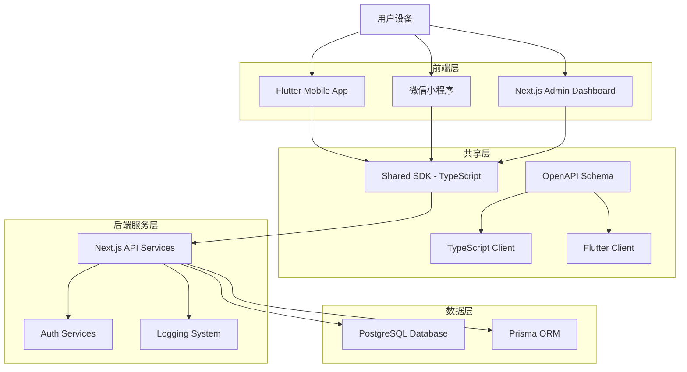
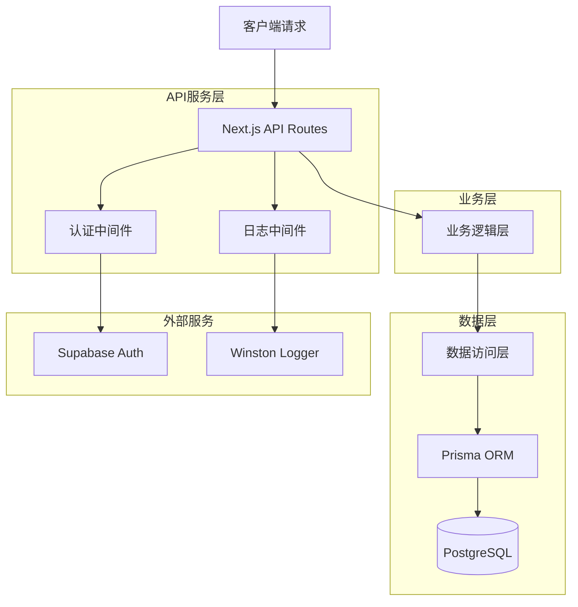
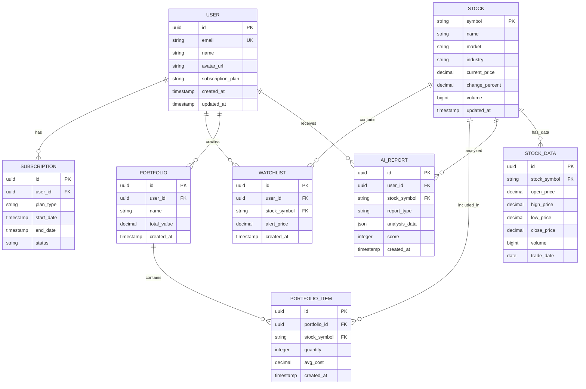

# 古灵通 (GuLingTong) 技术架构文档

## 1. 架构设计



## 2. 技术描述

- **移动端**: Flutter@3.16 + Riverpod@2.4 + Dio@5.3 + Hive@2.2 + go_router@12.0
- **小程序**: 微信原生小程序框架 + 自定义组件库
- **管理后台**: Next.js@14 + TypeScript@5 + Ant Design@5.12
- **API服务**: Next.js@14 Route Handlers + Prisma@5.6
- **数据库**: PostgreSQL@15 (通过 Supabase 提供)
- **认证**: Supabase Auth (Email Magic Link + 微信登录)
- **共享SDK**: OpenAPI@3.0 + TypeScript + Dart代码生成

## 3. 路由定义

### 3.1 移动端路由 (Flutter)
| 路由 | 用途 |
|------|------|
| /home | 首页，显示市场概览和快速导航 |
| /market | 行情页面，展示股票列表和搜索功能 |
| /stock/:id | 个股详情页面，显示具体股票信息 |
| /ai | AI分析页面，提供智能投资建议 |
| /portfolio | 投资组合页面，管理持仓和自选股 |
| /profile | 个人中心，用户信息和设置 |
| /login | 登录页面 |
| /register | 注册页面 |

### 3.2 小程序路由
| 路由 | 用途 |
|------|------|
| pages/index/index | 首页，市场概览 |
| pages/market/market | 行情列表页面 |
| pages/stock/stock | 个股详情页面 |
| pages/ai/ai | AI分析页面 |
| pages/profile/profile | 个人中心页面 |

### 3.3 管理后台路由 (Next.js)
| 路由 | 用途 |
|------|------|
| /dashboard | 概览页面，显示系统统计数据 |
| /users | 用户管理页面 |
| /subscriptions | 订阅管理页面 |
| /watchlist | 自选股和提醒管理 |
| /ai-reports | AI报告管理页面 |
| /data-sources | 数据源配置页面 |
| /audit-logs | 审计日志页面 |
| /login | 管理员登录页面 |

## 4. API定义

### 4.1 核心API

**用户认证相关**
```
POST /api/auth/login
```

请求参数:
| 参数名 | 参数类型 | 是否必需 | 描述 |
|--------|----------|----------|------|
| email | string | true | 用户邮箱 |
| password | string | false | 密码（Magic Link时可选） |
| provider | string | false | 登录方式：email/wechat |

响应参数:
| 参数名 | 参数类型 | 描述 |
|--------|----------|------|
| success | boolean | 登录状态 |
| token | string | JWT访问令牌 |
| user | object | 用户信息 |

**股票数据相关**
```
GET /api/stocks
```

请求参数:
| 参数名 | 参数类型 | 是否必需 | 描述 |
|--------|----------|----------|------|
| symbol | string | false | 股票代码 |
| market | string | false | 市场类型：sh/sz |
| limit | number | false | 返回数量限制 |

响应参数:
| 参数名 | 参数类型 | 描述 |
|--------|----------|------|
| stocks | array | 股票列表 |
| total | number | 总数量 |

**AI分析相关**
```
POST /api/ai/analyze
```

请求参数:
| 参数名 | 参数类型 | 是否必需 | 描述 |
|--------|----------|----------|------|
| symbol | string | true | 股票代码 |
| type | string | true | 分析类型：technical/fundamental |

响应示例:
```json
{
  "symbol": "000001",
  "analysis": {
    "score": 85,
    "recommendation": "买入",
    "reasons": ["技术指标向好", "基本面稳健"]
  }
}
```

## 5. 服务器架构图



## 6. 数据模型

### 6.1 数据模型定义



### 6.2 数据定义语言

**用户表 (users)**
```sql
-- 创建用户表
CREATE TABLE users (
    id UUID PRIMARY KEY DEFAULT gen_random_uuid(),
    email VARCHAR(255) UNIQUE NOT NULL,
    name VARCHAR(100) NOT NULL,
    avatar_url TEXT,
    subscription_plan VARCHAR(20) DEFAULT 'free' CHECK (subscription_plan IN ('free', 'premium', 'pro')),
    created_at TIMESTAMP WITH TIME ZONE DEFAULT NOW(),
    updated_at TIMESTAMP WITH TIME ZONE DEFAULT NOW()
);

-- 创建索引
CREATE INDEX idx_users_email ON users(email);
CREATE INDEX idx_users_subscription ON users(subscription_plan);
```

**股票表 (stocks)**
```sql
-- 创建股票表
CREATE TABLE stocks (
    symbol VARCHAR(10) PRIMARY KEY,
    name VARCHAR(100) NOT NULL,
    market VARCHAR(10) NOT NULL CHECK (market IN ('sh', 'sz', 'bj')),
    industry VARCHAR(50),
    current_price DECIMAL(10,3),
    change_percent DECIMAL(5,2),
    volume BIGINT,
    updated_at TIMESTAMP WITH TIME ZONE DEFAULT NOW()
);

-- 创建索引
CREATE INDEX idx_stocks_market ON stocks(market);
CREATE INDEX idx_stocks_industry ON stocks(industry);
CREATE INDEX idx_stocks_change_percent ON stocks(change_percent DESC);
```

**自选股表 (watchlist)**
```sql
-- 创建自选股表
CREATE TABLE watchlist (
    id UUID PRIMARY KEY DEFAULT gen_random_uuid(),
    user_id UUID NOT NULL REFERENCES users(id) ON DELETE CASCADE,
    stock_symbol VARCHAR(10) NOT NULL REFERENCES stocks(symbol),
    alert_price DECIMAL(10,3),
    created_at TIMESTAMP WITH TIME ZONE DEFAULT NOW(),
    UNIQUE(user_id, stock_symbol)
);

-- 创建索引
CREATE INDEX idx_watchlist_user_id ON watchlist(user_id);
CREATE INDEX idx_watchlist_stock_symbol ON watchlist(stock_symbol);
```

**AI报告表 (ai_reports)**
```sql
-- 创建AI报告表
CREATE TABLE ai_reports (
    id UUID PRIMARY KEY DEFAULT gen_random_uuid(),
    user_id UUID NOT NULL REFERENCES users(id) ON DELETE CASCADE,
    stock_symbol VARCHAR(10) NOT NULL REFERENCES stocks(symbol),
    report_type VARCHAR(20) NOT NULL CHECK (report_type IN ('technical', 'fundamental', 'sentiment')),
    analysis_data JSONB NOT NULL,
    score INTEGER CHECK (score >= 0 AND score <= 100),
    created_at TIMESTAMP WITH TIME ZONE DEFAULT NOW()
);

-- 创建索引
CREATE INDEX idx_ai_reports_user_id ON ai_reports(user_id);
CREATE INDEX idx_ai_reports_stock_symbol ON ai_reports(stock_symbol);
CREATE INDEX idx_ai_reports_created_at ON ai_reports(created_at DESC);
CREATE INDEX idx_ai_reports_score ON ai_reports(score DESC);

-- 初始化数据
INSERT INTO stocks (symbol, name, market, industry, current_price, change_percent, volume) VALUES
('000001', '平安银行', 'sz', '银行', 12.50, 2.15, 15000000),
('000002', '万科A', 'sz', '房地产', 18.30, -1.25, 8500000),
('600000', '浦发银行', 'sh', '银行', 8.95, 1.80, 12000000),
('600036', '招商银行', 'sh', '银行', 42.80, 0.95, 6800000);
```